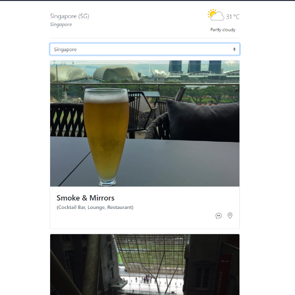

# Travel App
A simple travel web-app designed to provide information about the best destinations within the ASEAN region, along with the weather forecast for the next few days.

## Installation
### Requirements
#### System Requirements
- PHP v7.4.32
- Node v12.14.1

#### API Requirements
- [Weather API](https://www.weatherapi.com/)
- [FourSquare API](https://foursquare.com/)

#### Additional Dependencies
- [Laravel 7](https://laravel.com/docs/7.x)
- [Vue 2](https://v2.vuejs.org/)
- [Bootstrap Vue](https://bootstrap-vue.org/)

### Setup
1. Clone the repository.
2. Copy `env.example` file and name it `.env`.
3. Inside the `.env` file, search and provide the API keys for `API_KEY_FOURSQUARE` and `API_KEY_WEATHER`.
4. Run `composer install`. 
5. Run `php artisan key:generate`.
6. Run `npm install`.
7. Run `npm run prod`. 
8. Run `php artisan serve`.

## Features
- Weather
- Destination image & reviews

> **Note**: The features listed above will provide data for the capital city of each ASEAN member.

## Screenshot

.jpg)